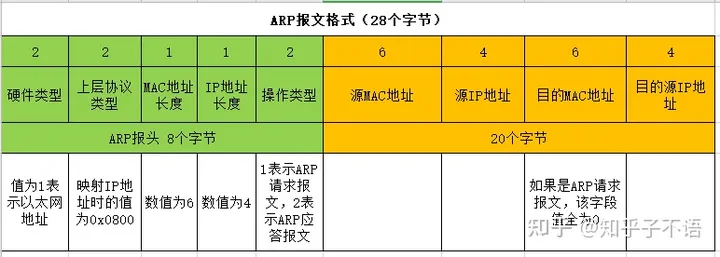
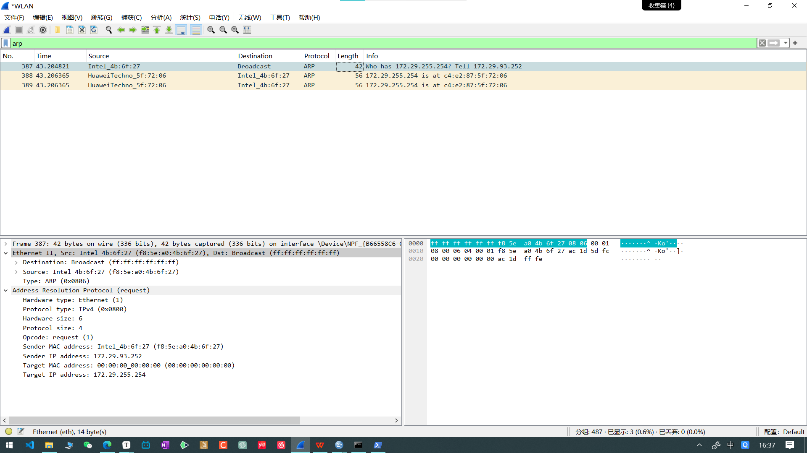
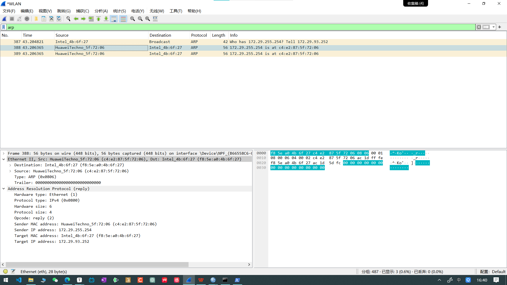
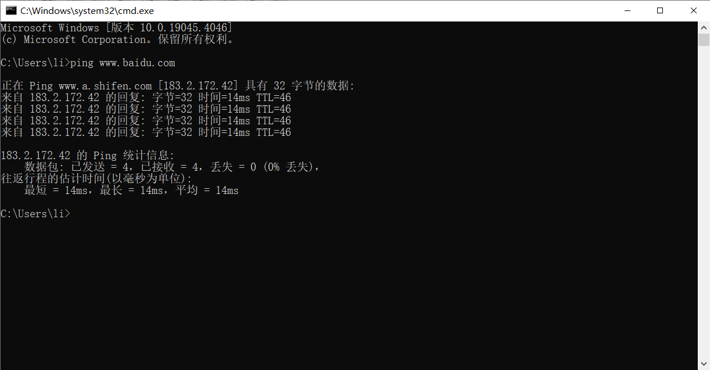
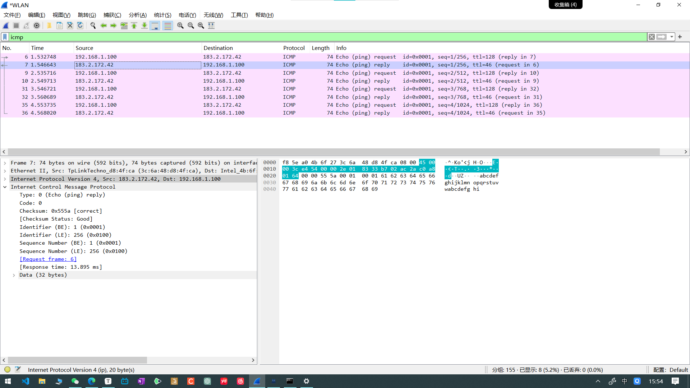

[TOC]


# Py代码练习

一些简单的py代码

## 爬虫练习

#爬虫   #Python   #音乐

爬虫代码 步骤

1. 已知目标

   获取什么数据，并且知道数据在哪？（URL）

   通过F12检查数据的位置

2. 构建思路

   解析目标的数据结构，选择技术

3. 爬取数据

   编写代码。保存数据

### request库

Python中的HTTP请求库通常指的是 `requests` 库。`requests` 是一个简洁而友好的HTTP请求库，使得发送HTTP请求变得更加简单和直观。你可以使用 `requests` 库发送各种类型的HTTP请求，包括GET、POST、PUT、DELETE等，并处理响应数据。

通过以下代码在终端安装

```bash
pip install requests
```

在python中使用

```python
import requests
```

在Bash中，你可以使用以下命令来查看已安装库的版本：

```bash
pip show <package_name>
```

显示有关 `<package_name>` 库的信息，包括版本号。


### 防止反爬

使用用户代理

### json数据转化网址

网址1：[JSON在线解析及格式化验证 - JSON.cn](https://www.json.cn/) （有广，但不影响）

## 网页后端

#后端   #go


## Flask练习


## Go web框架gin

### 安装 go 以及 vscode配置时的问题

1. 系统环境的配置，使用一个文件夹来存放go项目的代码

> 关于Web
>
> 1. Web是基于HTTP协议进行交互的应用网络
> 2. Web就是通过使用浏览器/APP访问的各种资源

关于客户端和服务器，客户端向服务器发送**请求**（**request**），服务器向客户端发送对应的**响应**（**response**），一个请求对应一个响应。

## 网络抓包练习

现有的网络抓包工具种类繁多，以下是其中一些常用的工具：

1. **Fiddler**：这是一个强大的网络抓包工具，能够记录所有客户端和服务器的HTTP和HTTPS请求。它允许用户监视、设置断点，甚至修改输入输出数据。Fiddler基于JScript.NET事件脚本子系统，主要支持HTTP协议，是程序员或网络管理员的必备工具。
2. **Wireshark**：这是一款开源的网络协议分析器，能够捕获网络中的数据包并为用户提供关于网络和上层协议的各种信息。Wireshark支持大量的协议，包括TCP、UDP、HTTP等，并能在多种操作系统上运行。它的功能强大，可以深入分析网络数据包，是网络安全工程师和网络管理员的常用工具。
3. **Tcpdump**：这是一个经典的Linux网络分析工具，用于捕获网络上的数据包。尽管它没有图形化的界面，但其强大的功能和便捷的使用方式赢得了广泛的用户群体。
4. **SolarWinds网络性能监控工具**：这款工具提供了广泛的数据包分析功能，能够显示网络运行概况。用户可以快速检测、诊断和解决任何网络问题。
5. **Network Miner**：这是一款网络取证分析工具，也是一款被动网络分析的开源工具，具备出色的图形用户界面（GUI）。
6. **ManageEngine NetFlow Analyzer**：这是一款功能完整的流量分析软件，使用流量技术为安全团队提供深入的信息，以提供最佳流量模式的带宽性能。

以下使用 Wireshark 来进行网络抓包

### 练习：使用 Wireshark 对常用协议抓包并分析原理

> 协议分析时最好关闭混淆模式，避免一些干扰的数据包存在

#### 常用协议分析：ARP协议

##### 什么是ARP协议：

（将IP地址解析成MAC地址）

ARP（Address Resolution Protocol，地址解析协议）是用于将IP地址映射到MAC地址的网络协议。在计算机网络中，当一台计算机要与另一台计算机通信时，它需要知道目标计算机的MAC地址（即物理地址），但通常只知道目标计算机的IP地址。这时，就需要使用ARP协议来获取目标计算机的MAC地址。

ARP协议的工作原理很简单：当一台计算机需要将IP地址解析为MAC地址时，它会向网络中广播一个ARP请求包，请求指定IP地址对应的MAC地址。目标计算机收到ARP请求后，会发送一个ARP响应包，其中包含了所请求的IP地址对应的MAC地址。这样，请求方就可以获得目标计算机的MAC地址，从而建立通信。

ARP协议在局域网中发挥着重要的作用，它使得计算机能够通过IP地址来识别其他计算机的物理位置，从而实现数据包的正确发送。

##### ARP报文格式：



##### 例子

使用以管理员身份启动的PowerShell，运行如下代码，

```powershell
arp -d
arp -a
```

Wireshark中抓包结果如下：

抓包结果1：请求



抓包结果2：回复



#### 常用协议分析：ICMP协议

##### 什么是ICMP协议

ICMP（Internet Control Message Protocol，互联网控制消息协议）是一种用于在IP网络上发送控制消息的协议。它主要用于在网络设备之间传递各种类型的控制消息，以检测网络连接的可达性、报告错误和提供诊断信息。

ICMP消息通常被用于以下几种情况：

1. **Ping命令**：ICMP Echo请求和Echo响应消息通常被ping命令用于测试主机之间的可达性。发送Echo请求后，如果目标主机可达，它会返回Echo响应，从而确认网络连接正常。
2. **路由错误报告**：当IP数据包在传输过程中遇到问题时，中间路由器会生成ICMP错误消息，如目的不可达、超时等，通知源主机发生了问题。
3. **路径MTU发现**：ICMP消息还可以用于路径MTU（Maximum Transmission Unit，最大传输单元）发现，帮助确定在源主机和目标主机之间的通信路径上的最大数据包大小。
4. **网络诊断**：网络管理员可以使用ICMP消息来诊断网络问题，如检测网络连接是否正常、分析数据包传输延迟等。

##### 例子

使用终端执行以下代码：

```bash
ping www.baidu.com
```

在Wireshark中过滤icmp的数据包得到如下数据，分为一次请求一次回复，共四轮，记8次数据包






其中请求的数据包的 `Internet Control Message Protocol` 中的 `type` 为 `8` 代表请求，回复数据包的 `type` 为 `0` ，代表回复；

`Checksum` 即校验和，在数据包传输过程中确保数据的完整性；

`[Checksum Status]` 即校验状态，指数据包中的校验和在接收端进行验证后的结果。在计算机网络中，当接收方收到一个数据包时，它会计算数据包的校验和，并将其与数据包中附带的校验和进行比较。这个比较的结果可以用来判断数据包是否在传输过程中发生了错误；

`Identifier(BE)`、`Identifier(LE)`、`Number(BE)`、`Number(LE)` 这四个数据，在请求和回复的过程中是不变的，分别为

- `Identifier(BE)`：指的是大端序的标识符，即标识符按照从高地址到低地址的顺序存储。
- `Identifier(LE)`：指的是小端序的标识符，即标识符按照从低地址到高地址的顺序存储。
- `Number(BE)`：指的是大端序的数字，即数字的高位字节存储在低地址处，低位字节存储在高地址处。
- `Number(LE)`：指的是小端序的数字，即数字的低位字节存储在低地址处，高位字节存储在高地址处。

`Request frame`、`Response frame` 即 请求帧、响应帧，数据代表与这个数据包相对应的数据包的帧；


#### 常用协议分析：TCP协议

##### 什么是TCP协议

TCP（Transmission Control Protocol，传输控制协议）是一种面向连接的、可靠的、基于字节流的传输层协议，它在计算机网络中扮演着重要的角色。TCP协议通过提供可靠的数据传输服务，实现了数据的可靠性、顺序性和流量控制。

TCP协议的特点包括：

1. **可靠性**：TCP通过使用序号、确认和重传机制来确保数据的可靠传输。每个数据包都带有一个序号，接收方收到数据后会发送确认消息，发送方在收到确认后才认为数据已成功传输，否则会进行重传。
2. **顺序性**：TCP保证了数据包的顺序性，即发送的数据包在接收方被重新组装成正确的顺序。
3. **流量控制**：TCP使用滑动窗口协议进行流量控制，允许发送方和接收方之间调节数据传输的速率，以适应网络的变化。
4. **面向连接**：TCP是面向连接的协议，通信双方在数据传输前需要先建立连接，然后在连接上进行数据传输，最后再关闭连接。
5. **全双工通信**：TCP支持全双工通信，即在同一时间数据可以双向传输，发送方和接收方可以同时发送和接收数据。

##### 例子

pass（终端出问题，暂时无法ping IP地址）


#### 常用协议分析：HTTP协议

##### 什么是HTTP协议

HTTP协议（Hypertext Transfer Protocol，超文本传输协议）是互联网上应用最为广泛的一种网络传输协议。它详细规定了浏览器和万维网服务器之间互相通信的规则，用户通过输入地址和端口号，可以从服务器上取得所需要的网页信息。

HTTP协议的主要特点包括：

1. **基于请求响应模式**：HTTP协议采用客户端-服务器架构模式，客户端（如浏览器）向服务器发送请求，服务器返回相应的响应。这种模式可以有效分离应用逻辑，提高系统的可维护性和扩展性。
2. **无状态性**：HTTP协议是一个无状态的应用层协议，即不会保存客户端与服务器之间的历史记录，每个请求都是独立的。这意味着服务器不会记住之前客户端的请求或响应，每个新的请求都需要包含足够的信息以供服务器理解并处理。
3. **基于文本传输**：HTTP协议使用ASCII码作为通信协议，每个请求和响应都是一条文本消息。这种方式使得通信协议更加简单、直观、易于处理。

在HTTP协议中，客户端发送给服务器的格式叫“请求协议”，而服务器发送给客户端的格式叫“响应协议”。请求协议包含了请求的方法（如GET、POST等）、请求的URL、请求头等信息；而响应协议则包含了状态码、响应头、响应体等信息。

##### 例子


### 遇到的问题

#### 1. ipv4与ipv6在Wireshark中的过滤语句

ipv4直接使用 `ip.addr == [ip地址]` 来进行过滤

ipv6则使用 `ipv6.addr == [ip地址]` 来进行过滤

1. wireshark 过滤 IPv4地址段
   ip.addr == 100.38.0.0/16(源地址/目的地址)
   ip.src == 100.38.0.0/16(源地址)
   ip.dst == 100.38.0.0/16(目的地址)
2. wireshark 过滤 IPv6地址段
   ipv6.addr == 2000::/16(源地址/目的地址)
   ipv6.src == 2000::/16(源地址)
   ipv6.dst == 2000::/16(目的地址)

#### 2. 终端突然ping命令一直请求超时

pass


# 一些常见的问题

## Vs代码无法提交仓库

当出现如下的报错信息时：

```
Git: fatal: unable to access 'https://github.com/LinYL03/Simple_Py_Code.git/': Failed to connect to github.com port 443 after 21054 ms: Couldn't connect to server
```

好厚米的解释是：
这个错误提示说明了 Git 在尝试连接 GitHub 时出现了问题。具体来说，它无法通过 HTTPS 访问 GitHub，因为无法连接到 github.com 的 443 端口，连接超时了。这可能是由于网络问题、防火墙设置、代理配置或 GitHub 服务器问题等原因引起的。要解决这个问题，你可以尝试以下几种方法：

1. **检查网络连接**：确保你的网络连接正常，尝试使用浏览器访问 GitHub 网站来确认是否能够连接。
2. **检查防火墙和代理设置**：如果你使用了防火墙或代理服务器，请确保其设置不会阻止 Git 连接到 GitHub。你可能需要配置防火墙或代理以允许 Git 的访问。
3. **尝试使用 SSH 协议**：如果你的网络环境允许，可以尝试使用 SSH 协议而不是 HTTPS 协议来进行 Git 操作。这样可以避免某些网络问题，但需要设置 SSH 密钥。
4. **尝试使用 VPN**：有时候使用 VPN 可以解决网络连接问题，你可以尝试连接到一个可靠的 VPN 服务并再次尝试 Git 操作。
5. **等待一段时间**：有时候 GitHub 服务器可能出现临时问题，稍等一段时间再次尝试可能会解决问题。

如果以上方法都无法解决问题，建议你查看 Git 的错误日志，其中可能会提供更多有关连接失败的详细信息，以便进一步诊断问题。

解决之后发现是网络问题。

